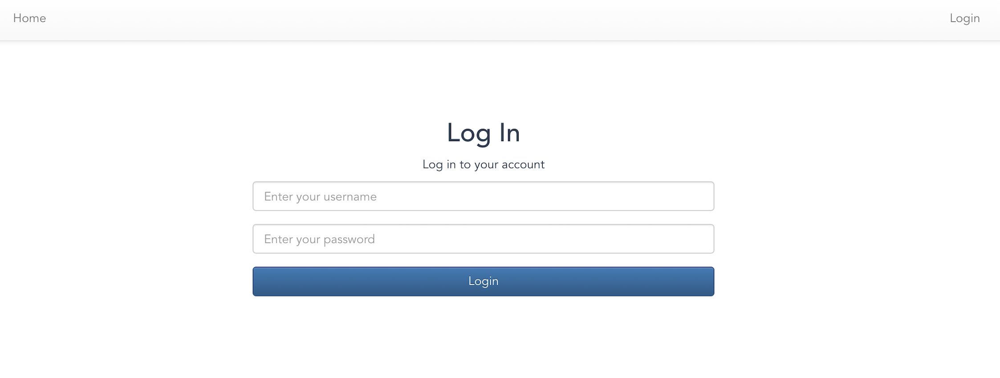
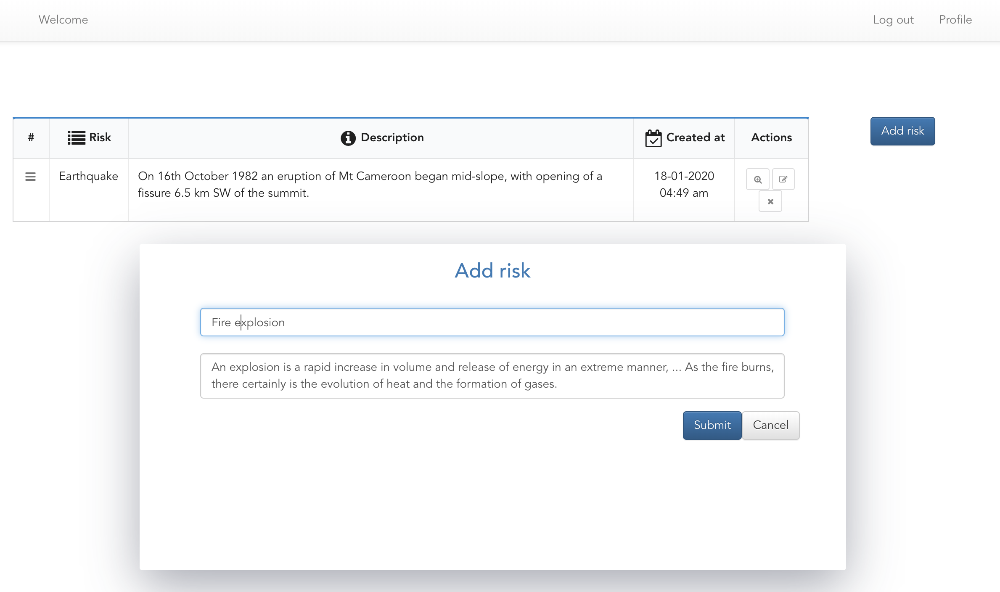
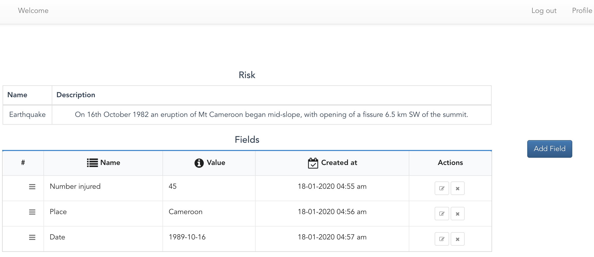
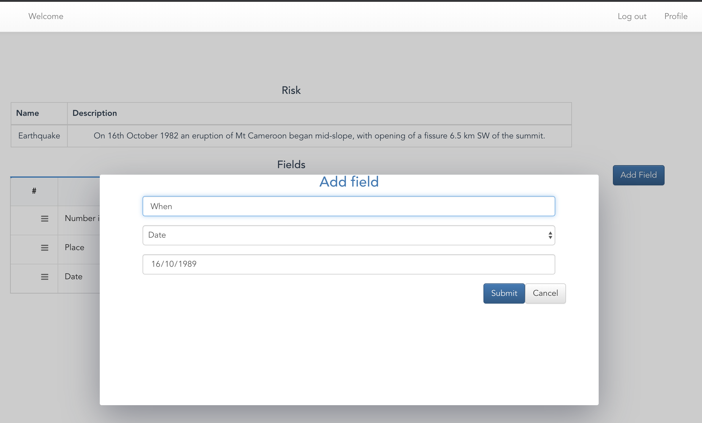

#### Background
Insurance is a form of risk management. Risks are anything that someone could incur a loss on. Company has historically worked primarily with property-based risks (homes, farms, churches, etc.).

#### Problem
Since its property-based insurance, the data model is pretty rigid. The data model assumes that all risks are properties and have addresses. This makes it difficult for Company to work with different forms of insurance like Automobile Policies, Cyber Liability Coverage (protection against hacking), or Prize Insurance (if someone gets a $1 million hole-in-one prize at a golf tournament, the golf course doesn't pay it, they have an insurance policy to cover them).

#### Primary Goal
We would like to see you come up with a solution that allows insurers to define their own custom data model for their risks. There should be no database tables called automobiles, houses, or prizes. Instead, insurers should be able to create their own risk types and attach as many different fields as they would like.

Fields are bits of data like first name, age, zip code, model, serial number, Coverage A limit, or prize dollar amount. Basically any data the carrier would want to collect about the risk. Fields can also be of different types, like text, date, number, currency, and so forth.

#### Data
For the data layer, model the risk types and how the generic fields and field types would relate to these risk types. Field types should be either text, number, date, or enum (where there are multiple potential options but only one choice can be made).


#### Setup

```sh
$ cd risker/
$ python3 -m venv  venv
$ source venv/bin/activate
$ pip install -r requirements.txt
$ python manage.py makemigrations profiles risks
$ python manage.py migrate
''' You create create super user from command line and login with it'''
'''Or you can login with username: admin and password: 123abc!! '''
$ python manage.py createsuperuser
''' To run test'''
$ python manage.py test
''' To start development test'''
$ python manage.py runserver
```
Application is started at 
```sh
127.0.0.1:8000
```

#### Frontend with Vue

* Handle all requests by axios interceptors
* Redirect when token expired or no login
* Handle JWT with Vuex to store states
* Save states into local storage
* Integrate backend API
* API support Authentication, create, update, delete Risk
* API support create, update, delete Fields
* API support adding as many fields as possible with supported types text, date, enum, number to a specific risk.

## Build Setup Frontend

``` sh
cd frontend

# install vue-cli
npm install -g @vue/cli

# install dependencies
npm install

# serve with hot reload at localhost:8080
npm run serve
npm audit fix
npm run serve


# To access front end
http://localhost:8080
```

### Proof




